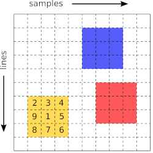
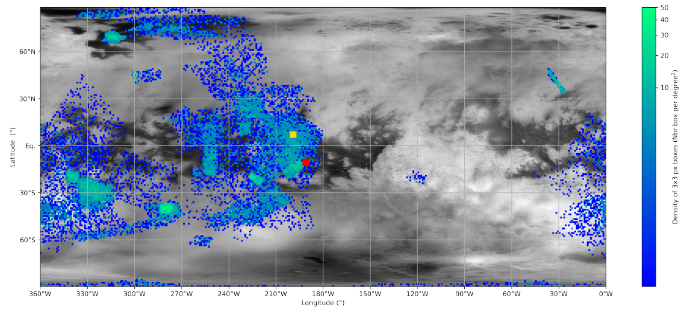
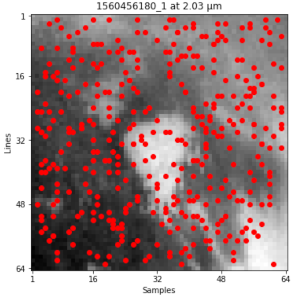
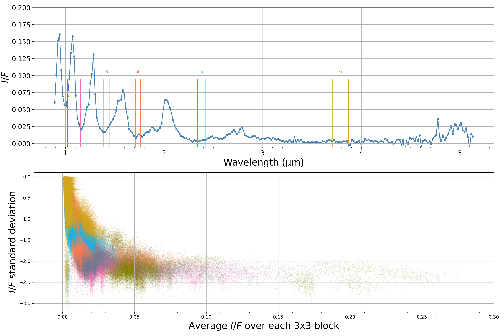

# Material for VIMS-IR uncertainties estimations

## About
The material available here is a supplementary material related to the paper
**Photometric Uncertainties of Cassini VIMS-IR Instrument** submitted to _Icarus_ by
[Cordier, D. ](https://orcid.org/0000-0003-4515-6271),
[Seignovert, B. ](https://orcid.org/0000-0001-6533-275X),
[Le Mouélic, S. ](https://orcid.org/0000-0003-3947-1072) and
[Sotin, C. ](https://orcid.org/0000-0003-3947-1072).

The main goal of this work is to estimate photometric uncertainties remaining in VIMS-IR cubes after calibration using
[USGS ISIS3 tool](https://isis.astrogeology.usgs.gov), the employed method relies on the definition of a collection of
3x3 pixels picked-up in each considered cube as it is summarized in the following sketch:

within each individual "block" or "box", for a given spectral channel, the variability of photometric quantities is computed.
The mean relative variability gives an approximation of uncertainties.

## Requirements
Basically, the programs, we make publicly available, require a recent `Python` version (3.x) and the very commonly used packages:
 - `os`, `sys`
 - `Numpy`
 - `Matplotlib`
 - `Pandas`
 - `time`
 - `re`
 - `random`
 - `datetime`
 - `scipy`
 - `titan`

together with the VIMS data management tool:
 - `PyVIMS` 
 
all these packages may be installed using the `pip` with command lines similar to `pip install pyvims`.

In addition, the provided Python modules `VIMSU_1.py`, `VIMSU_2.py` and `VIMS_uncertainties.py` should be available in the current
directory.

## Data
 - `VIMSuncert_cubes_list.csv`: `CSV` file containing the full list of the 149 high spatial resolution VIMS cubes analyzed.
    These cubes have a spatial resolution better than 35km/pixel.
 - `VIMS_CALCUBES/`: the directory containing all the 149 calibrated cube involved in the study. Using the list in the
   mentioned `CSV` file, all these cubes (total size: 313MB) may be automatically downloaded from Nantes University
   repository (https://vims.univ-nantes.fr/) with the `PyVIMS` tool.
 - since the analysis relies basically on a Monte-Carlo algorithm, we provide precisely used in our study under the
   form of 2 HDF5 files available in the directory `ANALYSIS_HDF5/`:
   - `stoDFrame_CubeData_NEW.hdf5` (48 KB) containing global features of employed cubes.
   - `stoDFrame_PavData_NEW.hdf5` (79 MB) containing the data of 3x3 pixels blocks picked-up in cubes.
   this way, any colleague, can potentially reproduce exactly the work we have done. Each of these compressed file contains
   a `Pandas` *DataFrame* which can be read and use *as it* in provided Jupyter notebooks. Of course, the interested reader
   can generate his/her own `HF5` file.

## Tools
The global analysis process is split into 2 steps:
 1. the random choice of 3x3 boxes in the cubes and the record of extracted data, stored in Pandas *DataFrames*, in
    `HDF5` files. This step can be accomplished with the Python Jupyter notebook:
    - `VIMS-IR_uncert_Part_ONE.ipynb`

    An example of spatial distribution of 3x3 boxes is reported in the following map of Titan surface, the colored
    encoding represents the surface density of chosen boxes:
    

    
    

    For memory, the Huygens landing site has been marked with a red square, while Selk crater
    (planned to be explored by [Dragonfly](https://dragonfly.jhuapl.edu)) is tagged with a yellow square.
    Titan surface mosaic a credit: NASA/JPL-Caltech/Univ. Arizona
    a https://photojournal.jpl.nasa.gov/catalog/PIA22770

 2. the data analysis strictly speaking, which can be done with the second Python Jupyter notebook:
    - `VIMS-IR_uncert_Part_TWO.ipynb`

## Procedure

 1. check if all the required Python modules are propertly installed on the machine.
 2. install all the present package, with or without the VIMS cubes available here (they can be downloaded automacically by
    the notebooks).
 3. use the first notebook `VIMS-IR_uncert_Part_ONE.ipynb` in which the name of the directory containing the VIMS cubes
    will be asked, this directory has to be available on your hard drive, even if it is empty. In this notebook, the user has
    to specify:
    - the name of the directory containing the cubes
    - for processed cubes, the fraction (0.10 is a reasonable value) of pixels that will be chosen as the "central pixel" of
      considered 3x3 boxes.
    - the names of the `HDF5` compressed files containing the data:
      - one with global features of cubes (exposure times, etc)
      - on with data of 3x3 boxes.

    As output, the user will get:
    - pictures of cube (at 2.03 microns) with chosen pixels identified by a red dot, these pictures are shown in the
      notebook itself, a copy of each one are saved in the directory `TEST_Plot_Distrib/`, if `TEST/` is the name of the
      directory containing the cubes. These plots, similar to that one:

      

      
      

      will be also shown in the notebook.
    - two `HDF5` compressed file, mentioned previously.
 4. use the second notebook `VIMS-IR_uncert_Part_TWO.ipynb`, this notebook is dedicated to data analysis, here an example
    of that could be obtained with this tool:

    

    
    

## License

The source code is provided under a open-source [GPLv3 license](LICENSE.md).
The input (`ANALYSYS_HDF5`) and output results (`fig/`) are distributed under a CC-BY-SA license.
The `VIMS_CALCUBES` were downloaded on the [VIMS Data Portal](https://vims.univ-nantes.fr).
